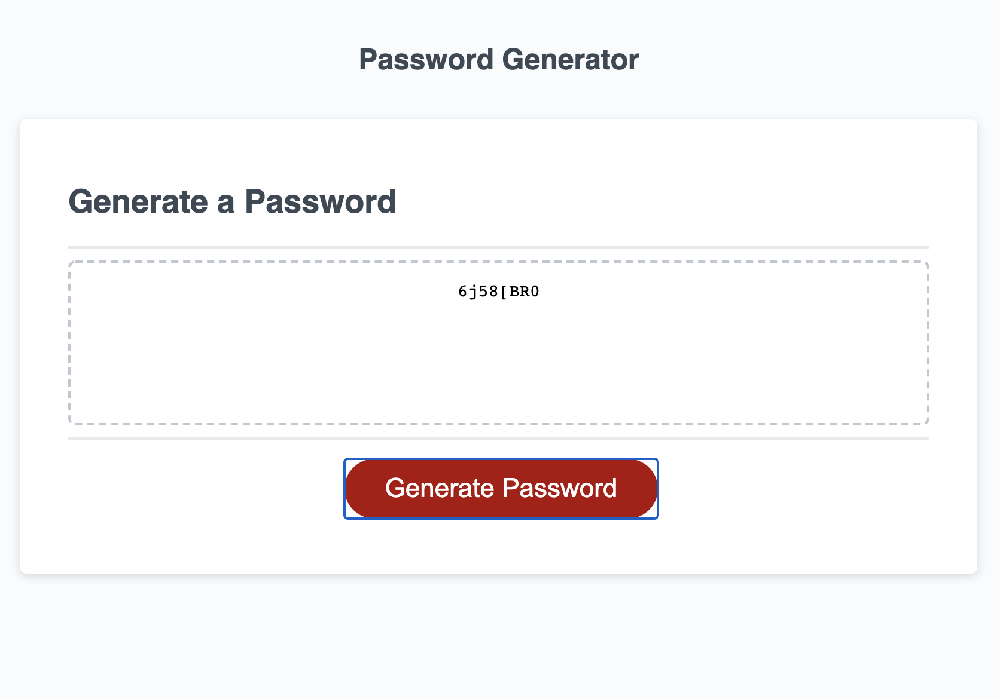
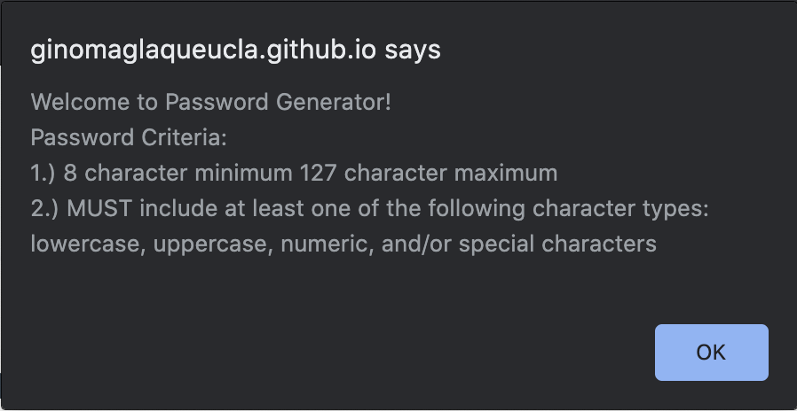
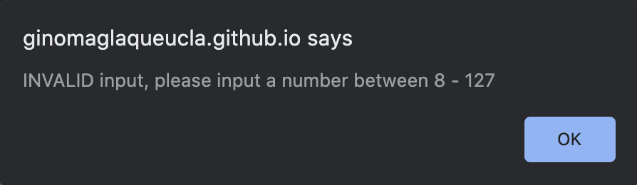
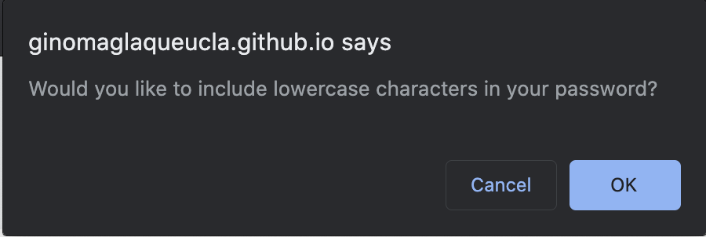
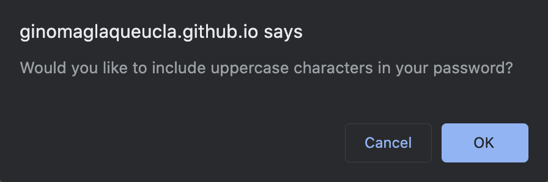

Installation:
    Go to the following link to view The Friendly Parakeet Password Generator site (https://ginomaglaqueucla.github.io/friendly-parakeet-gm20/)

    If accessing locally, clone repository from (https://github.com/ginomaglaqueucla/friendly-parakeet-gm20.git) to local directory on computer. Open index.html through your browser and mock-up site will come up.

Usage:
    The Friendly Parakeet Password Generator is web application that will simply generate a password based off of the inputs of the user. The user can set a password criteria of how the desired length of password (MUST be between 8 - 127 characters) as well as the option to select what character types is included in the password (MUST select at least one of the following: lowercase, uppercase, numeric, special). 
        1. The user will click the the [Generate Password] button
        2. User will input in prompt for valid password length
        3. User will select [OK] (Yes) or [Cancel] (No) for a series of confirms for character types
        4. The generated password will be displayed in the dotted box on the page

Usage (Screenshots):
Main Page

Welcome Alert Message

Password Length Prompt

Invalid Password Length Alert Message

Character Type Selection - Lowercase

Character Type Selection - Uppercase

Character Type Selection - Numeric

Character Type Selection - Special

Credits Changes/Commits by: ginomaglaqueucla - (https://github.com/ginomaglaqueucla/friendly-parakeet-gm20.git)

License MIT License

Copyright (c) 2020 Gino Maglaque

Permission is hereby granted, free of charge, to any person obtaining a copy of this software and associated documentation files (the "Software"), to deal in the Software without restriction, including without limitation the rights to use, copy, modify, merge, publish, distribute, sublicense, and/or sell copies of the Software, and to permit persons to whom the Software is furnished to do so, subject to the following conditions:

The above copyright notice and this permission notice shall be included in all copies or substantial portions of the Software.

THE SOFTWARE IS PROVIDED "AS IS", WITHOUT WARRANTY OF ANY KIND, EXPRESS OR IMPLIED, INCLUDING BUT NOT LIMITED TO THE WARRANTIES OF MERCHANTABILITY, FITNESS FOR A PARTICULAR PURPOSE AND NONINFRINGEMENT. IN NO EVENT SHALL THE AUTHORS OR COPYRIGHT HOLDERS BE LIABLE FOR ANY CLAIM, DAMAGES OR OTHER LIABILITY, WHETHER IN AN ACTION OF CONTRACT, TORT OR OTHERWISE, ARISING FROM, OUT OF OR IN CONNECTION WITH THE SOFTWARE OR THE USE OR OTHER DEALINGS IN THE SOFTWARE.